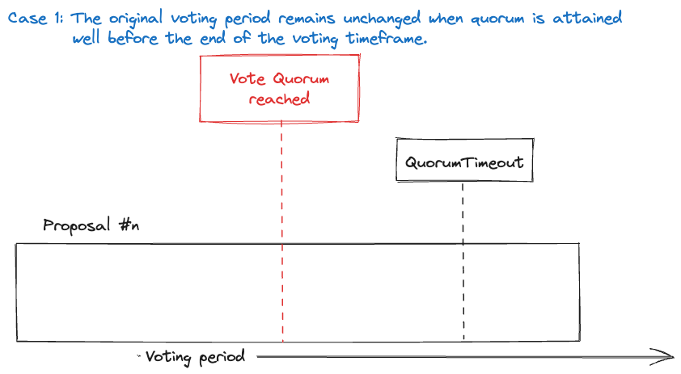
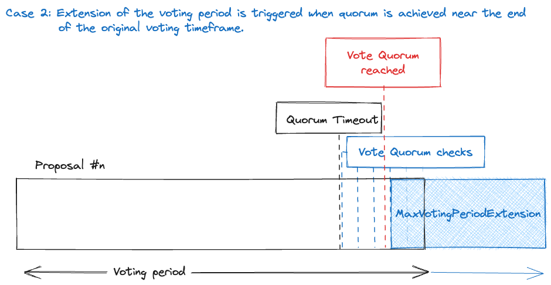

# ADR 066: Extension of Voting Period for Late Quorum in Governance Proposals

## Changelog

- 26 May 2023: Initial version
- 06 June 2023: Rewrite ADR with different approach
- 07 June 2023: Revised implementation
- 08 June 2023: Added diagrams
- 13 June 2023: Renamed parameters, updated diagrams, fixed some logic errors
- 27 June 2023: Updated parameters and formulas
- 04 July 2023: Refactor based on actual code implementation
- 11 July 2023: Updated text to reflect implementation changes

## Status

DRAFT Not Implemented

## Abstract

This ADR proposes a mechanism for extending the voting period of active governance proposals in the Cosmos SDK. The extension is triggered if quorum is achieved too close to the voting period's end, ensuring sufficient discussion time and mitigating potential governance manipulation.

## Context

In the current implementation of the `x/governance` module in the Cosmos SDK, a governance proposal that reaches quorum near the end of the voting period may not have sufficient time for discussion and deliberation among stakeholders.

The majority of community interest in a proposal arises when the vote quorum is reached. This is because a proposal's outcome only becomes valid after achieving quorum. Reaching quorum near the end of the proposal voting period could therefore be a symptom of low awareness about the proposal or could potentially be a form of governance manipulation.

To address this issue, we propose an extension mechanism for the voting period. By enforcing a delay when quorum is reached too close to the end of the voting period, we ensure that the community has enough time to understand all the proposal's implications and potentially react accordingly without the worry of an imminent end to the voting period.

## Alternatives

One alternative solution to the issue of proposals achieving quorum too close to the termination of the voting period is to universally and substantially extend the default voting period for all proposals. This would afford stakeholders additional time for discussion and deliberation on proposals, thereby reducing the probability of proposals achieving quorum late. However, this approach could unnecessarily lengthen the governance process for proposals that achieve quorum “in time”.

Another alternative could be the implementation of a notification mechanism that alerts stakeholders when a proposal is nearing quorum as the end of the voting period approaches. This could enhance awareness about the proposal and stimulate further discussion. However, this approach does not offer a solution to potential governance manipulation and would rely on stakeholders taking action in response to the notifications. Moreover, this alternative is strictly dependent on the front-end used by stakeholders and whether it implements this feature or not.

## Decision

We propose the introduction of three new parameters in the `x/governance` module:

- `QuorumTimeout`: This parameter defines the time window after which, if the quorum is reached, the voting end time is extended. This value must be strictly less than `params.VotingPeriod`.
- `MaxVotingPeriodExtension`: This parameter defines the maximum amount of time by which a proposal's voting end time can be extended. This value must be greater or equal than `VotingPeriod - QuorumTimeout`.
- `QuorumCheckCount`: This parameter specifies the number of times a proposal should be checked for achieving quorum after the expiration of `QuorumTimeout`. It is used to determine the intervals at which these checks will take place. The intervals are calculated as `(VotingPeriod - QuorumTimeout) / QuorumCheckCount`. This avoids the need to check for quorum at the end of each block, which would have a significant impact on performance. Furthermore, if this value is set to 0, the system described in this ADR is considered *disabled*.

We also introduce a new `keeper.QuorumCheckQueue` similar to `keeper.ActiveProposalsQueue` and `keeper.InactiveProposalsQueue`. This queue stores proposals that are due to be checked for quorum. The key for each proposal in the queue is a pair containing the time at which the proposal should be checked for quorum as the first part, and the `proposal.Id` as the second. The value will instead be a `QuorumCheckQueueEntry` struct that will store:

- `QuorumTimeoutTime`, indicating the time at which this proposal will pass the `QuorumTimeout` and computed as `proposal.VotingStartTime + QuorumTimeout`
- `QuorumCheckCount`, a copy of the value of the module parameter with the same name at the time of first insertion of this proposal in the `QuorumCheckQueue`
- `QuorumCheckTimestamps`, a list of timestamps at which quorum checks have been already performed, initially empty

When a proposal is added to the `keeper.ActiveProposalsQueue`, it is also added to the `keeper.QuorumCheckQueue`, unless it is an *expedited proposal*. The time part of the key for the proposal in the `QuorumCheckQueue` is initially calculated as `proposal.VotingStartTime + QuorumTimeout` (i.e. the `QuorumTimeoutTime`), therefore scheduling the first quorum check to happen right after `QuorumTimeout` has expired. Note that expedited proposals are not scheduled for quorum checks - i.e. are exempt from the mechanism described in this ADR. This is true unless an expedited proposal fails and is converted to a regular proposal, in which case they are also added to the `QuorumCheckQueue`.

In the `EndBlocker()` function of the governance module, we add a new call to `keeper.QuorumCheckQueue.Walk()` between the calls to `keeper.InactiveProposalsQueue.Walk()` and `keeper.ActiveProposalsQueue.Walk()`. In this `Walk()` we iterate over proposals that are due to be checked for quorum, meaning that their time part of the key is before the current block time.

We can check if quorum is reached by extracting only the relevant code from the `Tally()` method and create a new method `HasReachedQuorum()`. 

If a proposal has reached quorum (approximately) before or right at the `QuorumTimeout`- i.e. the  `QuorumCheckTimestamps` list is empty, meaning more precisely that no previous quorum checks were performed - remove it from the `QuorumCheckQueue` and do nothing, the proposal should end as expected.

If a proposal has reached quorum after the `QuorumTimeout` - i.e. there is at least one entry in `QuorumCheckTimestamps` - update the `proposal.VotingEndTime` as `ctx.BlockTime() + MaxVotingPeriodExtension` and remove it from the `keeper.QuorumCheckQueue`.

If a proposal is still active and has not yet reached quorum, remove the corresponding item from `keeper.QuorumCheckQueue`, modify the last `QuorumCheckQueueEntry` value by adding an entry to `QuorumCheckTimestamps` list to record this latest unsuccessful quorum check (i.e. the time part of the key last used in `QuorumCheckQueue`), and add the proposal back to `keeper.QuorumCheckQueue` with updated keys and value. 

To compute the time part of the new key, add a quorum check interval - which is computed as `(VotingPeriod - QuorumTimeout) / QuorumCheckCount` - to the time part of the last key used in `keeper.QuorumCheckQueue` for this proposal. Specifically, use the formula `lastKey.K1.Add((VotingPeriod - QuorumTimeout) / QuorumCheckCount)`. As mentioned, the value will instead be the same struct used earlier, with an additional entry in `QuorumCheckTimestamps` to record the additional unsuccessful quorum check performed.

If a proposal has passed its `VoteEndTime` and has not reached quorum, it should be removed from `keeper.QuorumCheckQueue` without any additional actions. The proposal's failure will be handled in the subsequent `keeper.ActiveProposalsQueue.Walk()`.

## Consequences

### Backwards Compatibility

The proposed modifications preserve backwards compatibility with the existing governance module of the Cosmos SDK. The introduction of new parameters—`QuorumTimeout`, `MaxVotingPeriodExtension`, and `QuorumCheckCount`—and the `QuorumCheckQueue` do not disrupt the current functionality of the governance module. These new elements will be activated for proposals initiated post-implementation of these changes. The governance process for pre-existing proposals will continue to adhere to the established voting period rules, because they won’t be present in the `QuorumCheckQueue`.

### Positive

- Promotes further discussion and deliberation for governance proposals.
- Mitigates potential governance manipulation by extending the voting period if the quorum is reached too close to the end of the voting period.

### Negative

- May prolong the governance process for proposals.

### Neutral

- Requires changes to the governance module and the introduction of new parameters.

## Further Discussions

- The duration of the voting period is utilized in *InterChain Security* (ICS) trusting computations for equivocation proposals. Specifically, the formula `consumerTrustingPeriod < consumerUnbondingPeriod - providerVotingPeriod` must hold to ensure the safety of ICS. If the voting period is extended due to this ADR, it will impact that formula (see discussion [here](https://github.com/cosmos/interchain-security/pull/964)). Therefore, we may need to exclude equivocation proposals from this feature.
- The proposed solution introduces some computational overhead due to the additional checks for quorum and the management of the `QuorumCheckQueue`. Checking if the quorum is reached multiple times for various active proposals could negatively impact performance, especially if several proposals are active simultaneously. It is important to limit the number of quorum checks to be sufficiently high for effectiveness, but not so high that checks are too frequent and result in noticeable performance degradation.

## Test Cases [optional]

## References

- Expedited proposals from `x/gov` README: [https://github.com/cosmos/cosmos-sdk/blob/0f1bfea1abc8a9e7caa613c4b9cab67b29706e77/x/gov/README.md#expedited-proposals](https://github.com/cosmos/cosmos-sdk/blob/0f1bfea1abc8a9e7caa613c4b9cab67b29706e77/x/gov/README.md#expedited-proposals)
- ICS implications on extending voting period: [https://github.com/cosmos/interchain-security/pull/964](https://github.com/cosmos/interchain-security/pull/964#discussion_r1206403773) see discussion